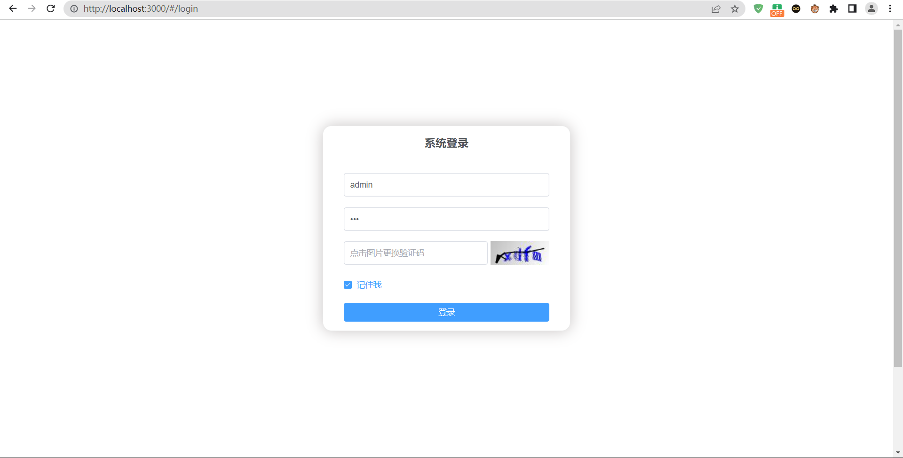
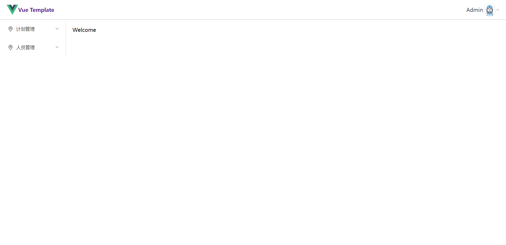
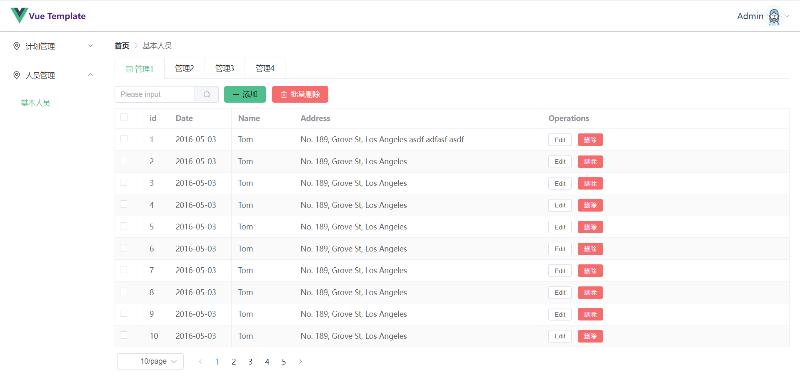

# Vue 3 + Vite
## 简介

一个简单的后台管理页面

vue3 + vite + vue-router4 + vuex + axios + elementui-plus

实现了 动态路由

使用 vite 代理解决 跨域问题  vite版本2.9.0  详细配置见(vite.config.js)

## 效果图

## 参考文档

vite官方文档 https://vitejs.cn/

vue-router https://router.vuejs.org/zh/

elementui-plus https://element-plus.gitee.io/zh-CN/#/zh-CN/component/installation